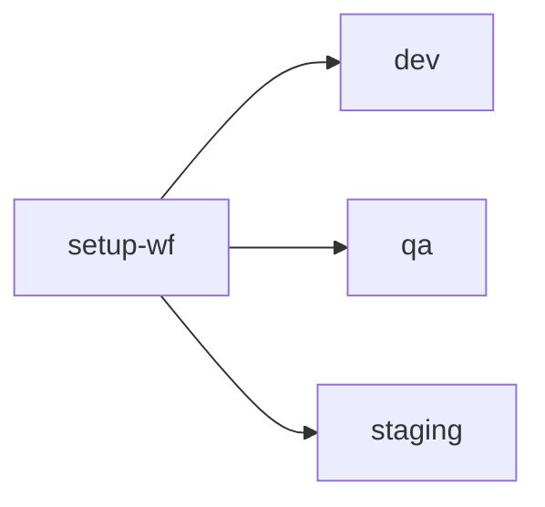

### dynamic-config-triggers in CircleCI

This is an example CircleCI config setup that can conditionally trigger different workflows based on a combination of Pipeline Parameters. 

One of the advantages of this setup is that a completely different set of parameters can be passed to downstream workflows when they are conditionally triggered.

